.. index:: Data Managemement

***************
Data Management
***************

This is the part where every day uses of the system depend. It contains functionalities which involve the regular management and use of Human Resource data.

.. index:: Data Entry

Data entry
==========

In here you can select the forms designed in the previous part so that you can populate data.
On Clicking data entry the screen below will be displayed before a list of available forms.

.. _fields_image:
.. figure::  _static/dataentry.png
   :align:   center

.. centered:: **fig 3.1: Image showing the Interface of a Data entry form loading data.**

.. _fields_image:
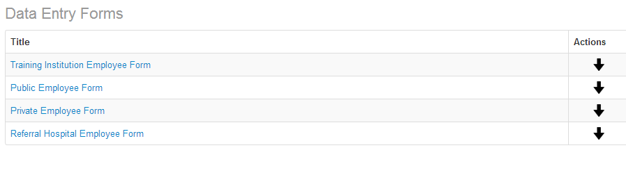
.. centered:: **fig 3.2: Image showing the List of Forms Available for Entering Data.**

Data entry forms are categorized according to the type of Employer. Select Public Employee form when entering public employee record and private employee form private/FBO Employee record. Also select Referral Hospital Employee Form when entering record for specialized/Consultant hospital employee by clicking on down arrow on the right hand of Data entry Forms.

An example of the form ready for data entry is as follows:

.. _fields_image:
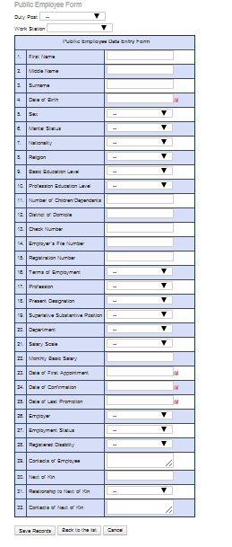
.. centered:: **fig 3.3: Image Showing Data entry Form ready for Data Entry(Public Employee form.**

Fill the form with the appropriate data then click on the “Save Records” button to submit data to the database. There are a few things to notice though; of these fields there are compulsory ones which need to be filled in for any data entry to be successful. In addition one must select first Duty post and work station before entering other informations.
 
.. _fields_image:
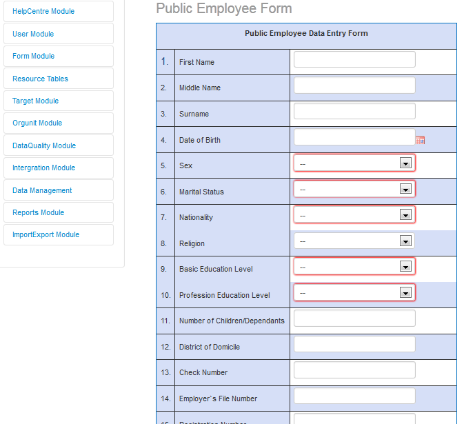
.. centered:: **fig 3.4: The red covered Fields are the Compulsory ones.**

.. index:: Update Records

Update Records
==============

This option allows user to view the records already entered into the system of their respective organization unit. If Update records option is selected, it will load data before listing available forms.

.. _fields_image:
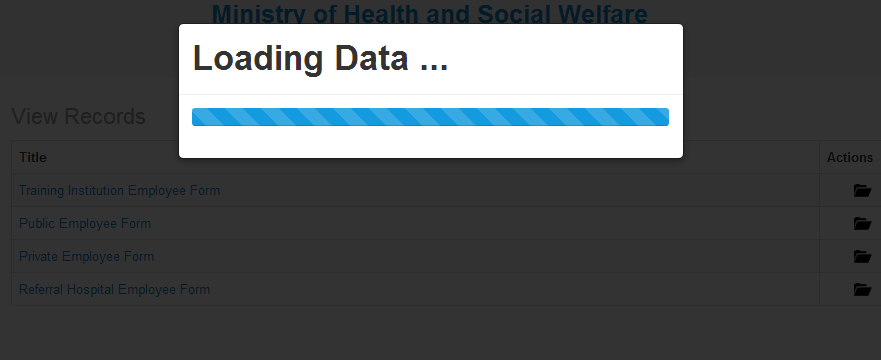
.. centered:: **fig 3.5: Update records Loading Data.**

.. _fields_image:
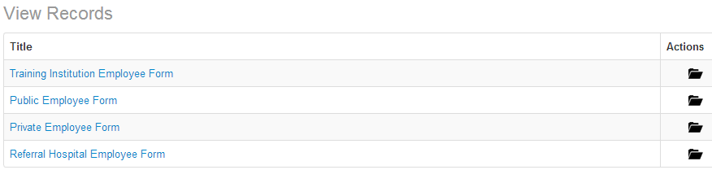
.. centered:: **fig 3.6: List of forms in View records options.**

If Show all records options is selected, the system will display all records that have already been entered into the database for the respective user’s organization and form type. See image below

.. _fields_image:
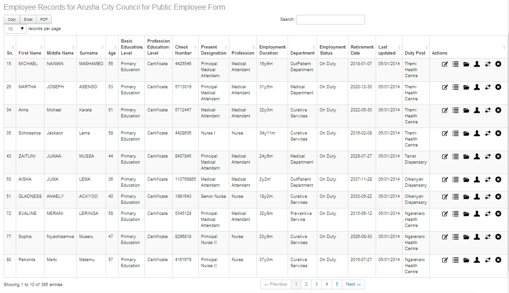
.. centered:: **fig 3.7: An example of records in the system for Arusha City Council, Public Employee Form.**

At the end of each record row, there are six options discussed here under in details: 

.. index:: Edit Records

Edit Records
------------

It is used in case you need to update some information of a particular record that was entered initially. Click the edit icon, and the form will be opened for you to update the selected record.

.. index:: History Management

History Management
------------------

This stands for Record’s History Management, by Selecting History option of a particular record, that record’s history will be displayed as if has been added before. If the record has no history details the interface shown in the image bellow will be displayed:

.. _fields_image:
.. figure::  _static/historymanage.png
   :align:   center
.. centered:: **fig 3.8: Image showing a table of an employee record that has no History Details.**

To add a history click “Add History” and then an interface shown in the image below will be displayed:

.. _fields_image:
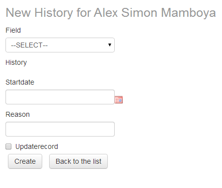
.. centered:: **fig 3.9: Image showing an Interface for adding History to a record.**

To add history update of an employee record fill the form as displayed in the above figure then tick the “updaterecord” check box to make the record updated and finally click “Create” to add the history.

.. _fields_image:
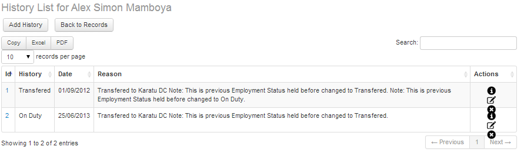
.. centered:: **fig 3.10:  Image showing an interface of History Details of an employee record.**

The image above shows a list of History details of an employee with each detail having options to show, edit or delete a history detail in the column titled “Action”.

.. index:: In-service Training Management

In-service Training Management
------------------------------

This refers to different courses, mostly short courses attended by an employee. The trainings include HRHIS, DHIS, Malaria and Reproductive Health Trainings/courses. The diagram below displays an interface showing how In-service training details of an employee record is displayed

.. _fields_image:
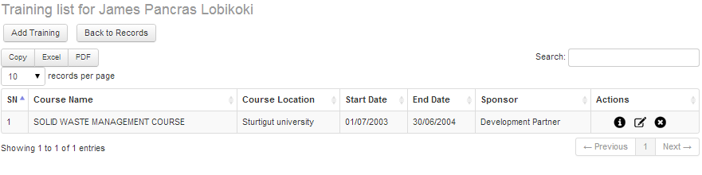
.. centered:: **fig 3.11:  In-service training information of a record.**

However options Add Training and Back to Records will b e displayed if the employee record has no In-service Training details. To add a new in In-Service Training detail click “Add Training” and a form displayed in the image below will be displayed:

.. _fields_image:
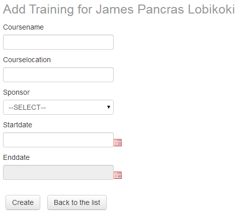
.. centered:: **fig 3.12:  Image showing an interface for adding an In-Service Training of an employee record.**

.. index:: Change Form

Change Form
-----------

This is a functionality which can be used to transfer employee information from one data entry form to another. It can be used when an employee previously employed in a private/FBO facility has been employed by a public facility. Also it might be that by mistake an employee was entered into an incorrect form and thus his/her details have to be transferred to another form.
Click the second button from left    then the interface like the one shown in the image below here will appear where the choice of the form to which you need to transfer the employee’s details can be made.

.. _fields_image:
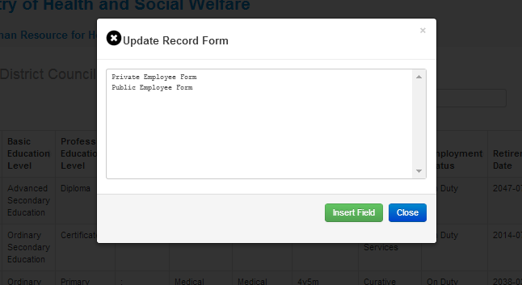
.. centered:: **fig 3.13:  Image showing an interface for changing a form (Transfer an employee’s data from one form to another).**

.. index:: Data Validation

Data Validation
===============

This functionality is used to verify the logical correctness of the data entered into the System. For instance to check if the records already entered have all the compulsory fields filled with data.
To run validation click “data validation”, select Organization unit, then click “Use data for selected unit with lower level” – if you want to run validation for all the organization units under your organization unit. Now, select from validations available (you can run more than one validation at once), thereafter select the type of form(s) from “Available Forms”. Finally click “Submit” button to see the results. The image below shows the interface for running the validation:

.. _fields_image:
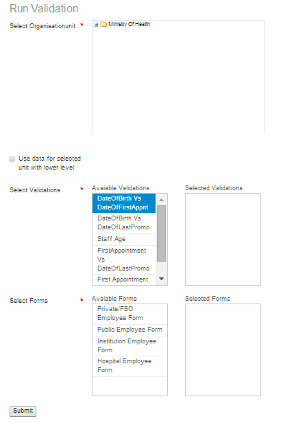
.. centered:: **fig 3.14:  Image showing an interface for running Data Validation.**
 

 

