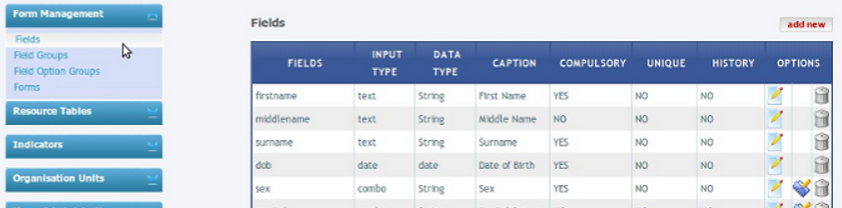
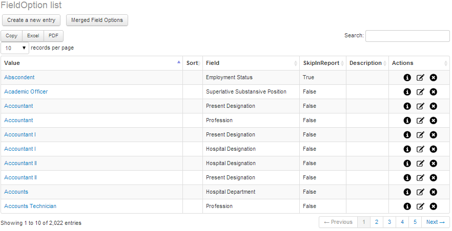
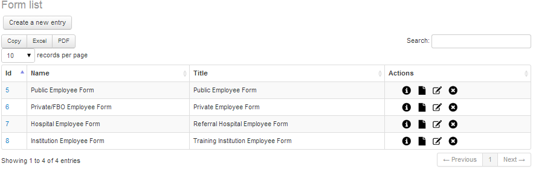
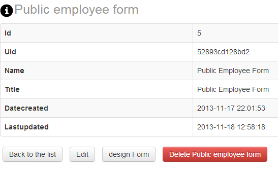
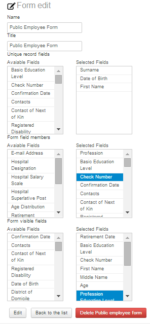
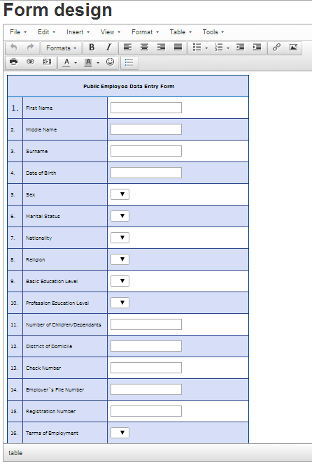
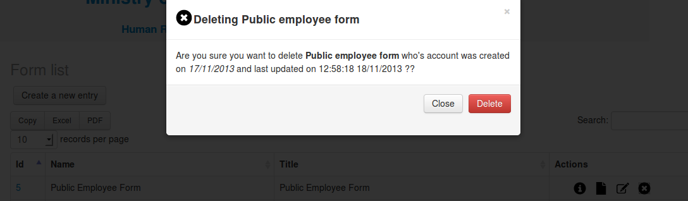


.. index:: Form Management

***************
Form Management
***************

This module deals with the management of the data entry forms including the field options. This module is used mostly by system administrator for modification of form fields when there is a change of requirements.

.. index:: Fields

Fields
======

This sub module is used to add, edit, or delete database fields which hold data supplied by the user. Examples of the fields include dob (stands for Date of Birth), file_no (stands for file number), etc. The table shown in the image below shows a specific fields, their input type, data type, caption, a mark to show whether it is compulsory or not, and options to show field details, edit or delete.

.. _fields_image:

.. centered:: **fig 2.1: Image showing Form Fields Interface.**

Note: For the fields with the combo input type click on the icon following the edit options to assign more field options. Click the next icon to merge field options, if any is needed.

.. index:: Field Options

Fields Options
==============

Combo form fields have options that allow users to select in combo box. The screen shot below shows some combo field options.

.. _fields_image:

.. centered:: **fig 2.2: Image showing interface of combo field options.**

.. index:: Forms

Forms
=====

This sub-module is used to create new or edit already existing data entry forms. On the right hand side of each form are the options to view, edit form details, design, and deleting the form. 

.. _fields_image:

.. centered:: **fig 2.3: Image showing list of forms available in the system and icons to manage them.**

.. index:: Show Details

Show Details
------------

The first option is the “Show Icon”, necessary details of the form are shown after clicking this icon. For example, details for Public employee form are as shown in the screen shot below:

.. _fields_image:

.. centered:: **fig 2.4: Image showing Public Employee Form Details.**

.. index:: Edit Form

Edit Form
---------

To edit a form, click on the third icon in its field of “Actions”. Click the specific field on the left to add it to the form. Once a specific field option is clicked from the “Available Fields”, the field option will be moved to the right side, named “Selected Fields”.  

.. _fields_image:

.. centered:: **fig 2.5: Interface for editing the form and adding details.**

.. index:: Form Design

Form Design
-----------

On the second option, Design, the screen shot below should appear. Put the names of the form fields you want and for each field assign the database field corresponding to it and then click on the “Save Form” button to save the form. At any point during the design of the form, clicking the “Reset” button should instigate clearing.

.. _fields_image:

.. centered:: **fig 2.6: Interface for editing the form and adding details.**

.. index:: Delete Form

Delete Form
-----------

The last icon is the delete option, Delete icon was placed purposely for the removal of the unwanted option in the list. However this option has to be used with care since if the field is deleted there is no way to be recovered that is why user has to confirm the details displayed once the delete icon is clicked, Below is a screen shot of the details displayed including the name of the field, date of creation and update that user is attempting to delete. 

.. _fields_image:

.. centered:: **fig 2.7: Interface for the MOHSW Children.**

