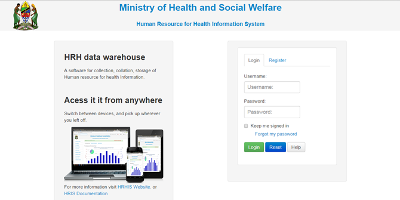
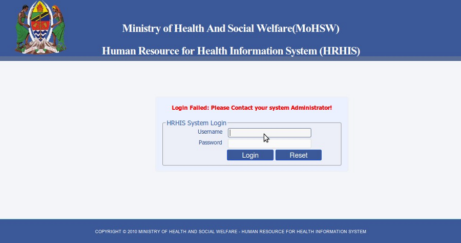
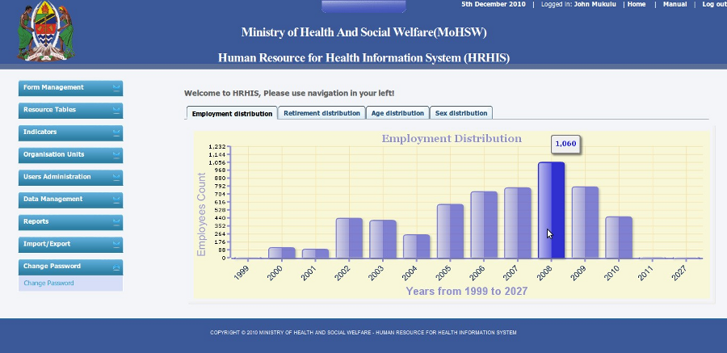
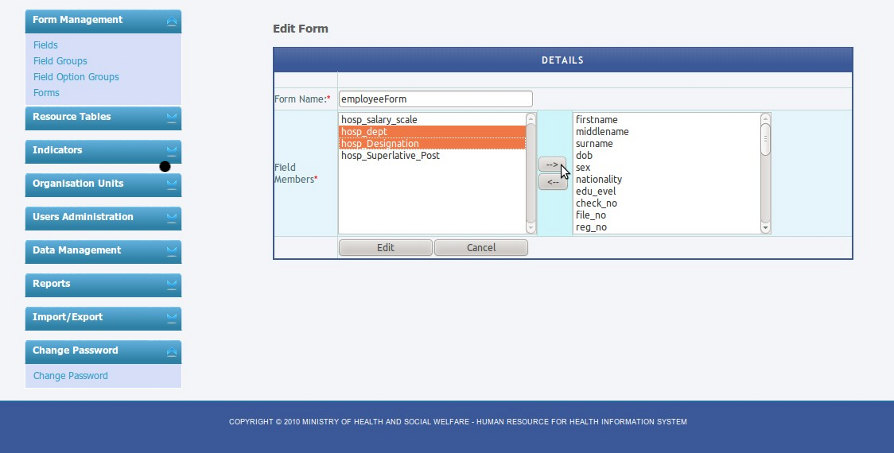
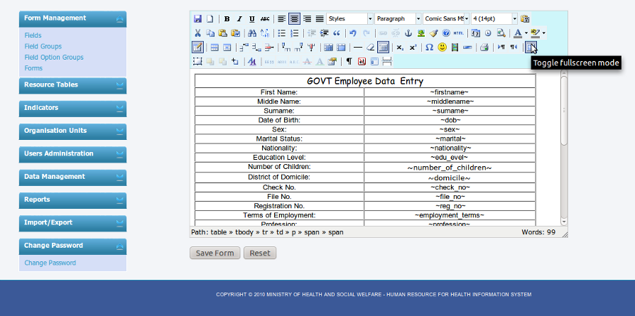

.. _images:

******
Images
******

.. _login:

.. _fig1:

.. centered:: **fig 1: Login Interface**

.. _unsuccessful_login_image:

.. centered:: **fig 2: Unsuccessful Login Interface**

.. _home_interface_image:

.. centered:: **fig 3: Interface displayed after successful login**

.. _system_description:

.. _fig4:
.. figure::  _static/fields.png
   :align:   center

.. centered:: **fig 4: Fields Interface**

.. _fig5:
.. figure::  _static/forms.png
   :align:   center

.. centered:: **fig 5: Interface for editing the form and adding details**

.. _fig6:

.. centered:: **fig 6: Interface for editing the form and adding details**

.. _fig7:

.. centered:: **fig 7: Interface for designing the form and assigning it the fields you want.**

.. _fig8:
 .. figure::  _static/dataentry.png
    :align:   center

 .. centered:: **fig 8: List of form available for entering data.**

 .. _fig9:
 .. figure::  _static/formfordataentry.png
    :align:   center

 .. centered::**fig 9: Form ready for data entry.**

 .. _fig10:
 .. figure::  _static/afieldmessage.png
    :align:   center

 .. centered::**fig 10: A message to describe the data field**

 .. _fig11:
 .. figure::  _static/records.png
    :align:   center

 .. centered:: **fig 11: View records options**

 .. _fig12:
 .. figure::  _static/viewrecord.png
    :align:   center

 .. centered:: **fig 12: Search record option**

 .. _fig13:
 .. figure::  _static/recordhistory.png
    :align:   center

 .. centered:: **fig 13: A list of records in the system**

 .. _fig14:
 .. figure::  _static/historymanagement.png
    :align:   center

 .. centered:: **fig 14: History Information of a record**

 .. _fig15:
 .. figure::  _static/addhistory.png
    :align:   center

 .. centered:: **fig 15: Add History**

 .. _fig16:
 .. figure::  _static/inservicemanagement.png
    :align:   center

 .. centered:: **fig 16: In service training information of a record**

 .. _fig17:
 .. figure::  _static/addtraining.png
    :align:   center

 .. centered:: **fig 17: In service training information of a record**

 .. _fig18:
 .. figure::  _static/organizationunit.png
    :align:   center

 .. centered:: **fig 18: Interface to display Organization Units.**

 .. _fig19:
 .. figure::  _static/manageunits.png
    :align:   center

 .. centered:: **fig 19:Interface for the MOHSW Children**

 .. _fig20:
 .. figure::  _static/editunit.png
    :align:   center

 .. centered:: **fig 20: Form for editing organization unit details**

 .. _fig21:
 .. figure::  _static/oragnieunitgroup.png
    :align:   center

 .. centered:: **fig 21: Interface for displaying organization unit groups**

 .. _fig22:
 .. figure::  _static/editorganizationunit.png
    :align:   center

 .. centered:: **fig 22:  Editing organization unit group details.**

.. _users:

 .. _fig23:
 .. figure::  _static/addorggroupset.png
    :align:   center

 .. centered:: **fig 23: Creating new organization unit group set.**

.. _fig24:
 .. figure::  _static/edituserrole.png
    :align:   center

 .. centered:: **fig 24: Interface for editing user role.**

 .. _fig25:
 .. figure::  _static/availableuser.png
    :align:   center

 .. centered:: **fig 25: Interface displaying available system users.**

.. _reports:

 .. _fig27:
 .. figure::  _static/reports.png
    :align:   center

 .. centered:: **fig 27: Record Report Generation.**

 
 .. _fig28:
 .. figure::  _static/recordreport.png
    :align:   center

 .. centered:: **fig 28: An example of Record Report.**

 .. _fig29:
 .. image::  _static/exporttoexcl.png
    :align:  center

 .. centered:: **fig 29: Export to Spreadsheet Buttons.**

 .. _fig30:
 .. figure::  _static/generatedexcl.png
    :align:  center

 .. centered:: **fig 30: An example of Record Report.**

 .. _fig31:
 .. figure::  _static/aggrreport.png
    :align:  center

 .. centered:: **fig 31: Generating aggregated report.**

 .. _fig32:
 .. figure::  _static/aggrreport1.png
    :align:  center

 .. centered:: **fig 32: An aggregated report (field one: age distribution, field two: sex).**

 .. _fig33:
 .. figure::  _static/aggrreport2.png
    :align:  center

 .. centered:: **fig 33: An aggregated report (field one: employment distribution, field two: sex).**

 .. _fig34:
 .. figure::  _static/aggrreport3.png
    :align:  center

 .. centered:: **fig 34: An aggregated report (field one: Retirement distribution, field two: sex).**

 
 .. _fig35:
 .. figure::  _static/aggrreport4.png
    :align:  center

 .. centered:: **fig 35: An aggregated report (Single field: Employment distribution).**

 .. _fig36:
 .. figure::  _static/historyintraining.png
    :align:  center

 .. centered:: **fig 36: History and In service Training report.**

.. _import_export:

 .. _fig38:
 .. figure::  _static/import.png
    :align:   center

 .. centered:: **fig 38: Interface for importing data into the system.**

 .. _fig39:
 .. figure::  _static/exporttodhis.png
    :align:   center

 .. centered:: **fig 39: Interface for importing data into the system.**