.. index:: report

*******
Reports
*******

Reports are the most important component of any information system. HRHIS allows users to generate various reports from already entered data and export these reports from the system to other formats such as excel or portable document format (pdf) for further manipulation, interpretation or analysis use . 
HRHIS groups reports in six main groups; namely, “Records report” which is basically a report of the list of all records entered by specified user with exception of those whose employment status has been updated to retired, deceased and transferred. 
Secondly is “Aggregated Reports” which as suggested by the name are outputs that aggregate data of fields specified by user. Thirdly, “Completeness Report” which is used to determine the entered number of records in each organization unit against the initial expected value entered for each facility. Fourth, is the “Orgunit reports” these are reports of organization units in specified users account. The organizations units are categorized either by level or by group set.

Fifth, is the “History and training report” which tracks all the history updates of records as have been done for already entered records while training report is for all the In-service trainings updated for each record. Lastly, “Friendly reports” which is a combination of reports for human resource required in Health Plan such as CCHP and CHOP.

.. index:: Records reports

Records reports
===============

There are only three items to select in order to generate this report – the organization unit, which form should the data be included from and if it should use only selected organization unit or with lower levels. If the check box is not selected it will only use data of selected organization unit without the facilities under that unit.
After generating a report, the system will filter the available data and display them according to selected specifications. Note that the results from this report will exclude all entered stuff whose employment status is set to retired, off duty, transferred and deceased.

.. _fields_image:
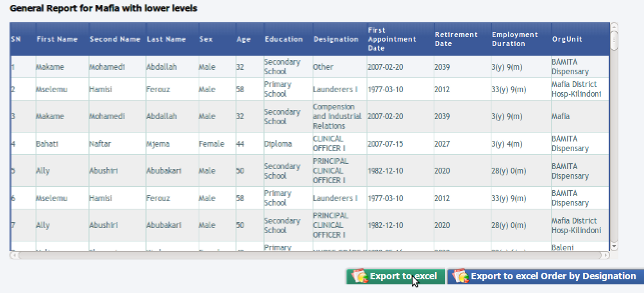

.. centered:: **fig 4.1: Image showing Steps to Generate Records Report.**

Below is an example of a record report generated from Arusha City Council with its lower levels, the facilities.
 

.. _fields_image:
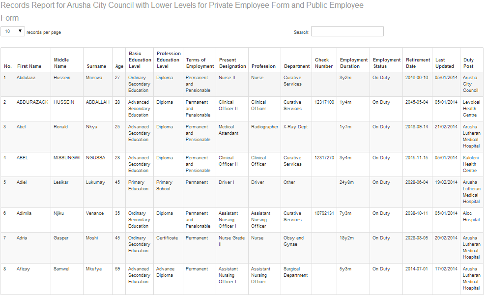

.. centered:: **fig 4.2: Screenshot showing part of Record Report Generated for Arusha City Council with Lower Levels.**

When the report has been generated, there are two buttons at the end, “Export to EXCEL” option, found at the lower left corner of the screen, that will enable you to export your report to excel sheet (spreadsheet) for further personal manipulation without affecting the data in the system.

.. _fields_image:
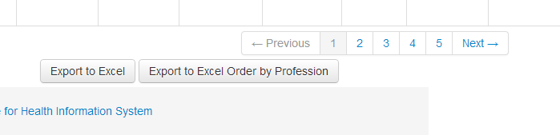

.. centered:: **fig 4.3: Export to Spreadsheet Buttons.**

Click it and see the results – the spreadsheet
“Export to Excel Order by Profession” which also sends the report to spreadsheet but groups the information by profession. For instance all the doctor records will be under doctor profession, nurses under nurses and so forth.

.. _fields_image:
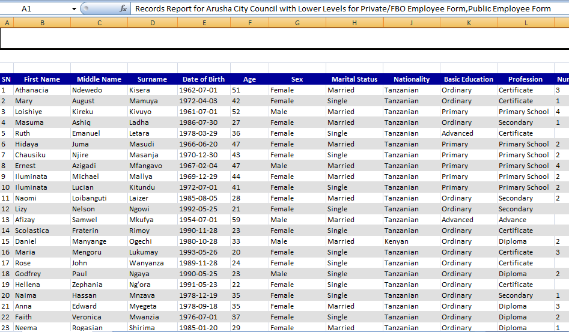

.. centered:: **fig 4.4: Image showing example of spreadsheet file part for Arusha City Council with Lower Levels using export to excel button.**

.. index:: Aggregated Reports

Aggregated Reports
==================

These are the reports whose output is of graph format depending upon the selected Field Option for instance Present Designation. Similar procedures of generating a record report are used, but in this case you have to select one or two Fields using which the “Aggregated Report” should be generated.

.. _fields_image:
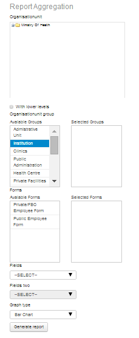

.. centered:: **fig 4.5: Image showing steps to generate aggregated report.**

The aggregated data, in this new release gives the user more ways to explore the data that are in the system already. It allows a user to specify the organization units they want the report for, select the form in which the data will be chosen for report and then select the data to view. These data are in two fields, field one and field two. However, you can also generate this report by selecting only one field and not comparing it to any other field. To do so you have to specify field one and in field to select the option for “use only one field”. This will aggregate only data for field one selected. 
 

.. _fields_image:
.. figure::  _static/aggregatereport1.png
   :align:   center

.. centered:: **fig 4.6: An aggregated report (field one: age distribution, field two: sex).**

.. _fields_image:
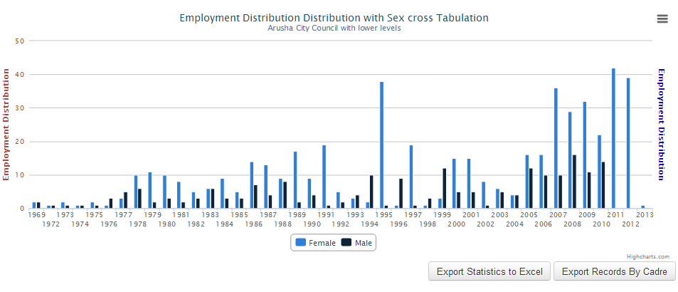

.. centered:: **fig 4.7: An aggregated report (field one: employment distribution, field two: sex).**

.. _fields_image:
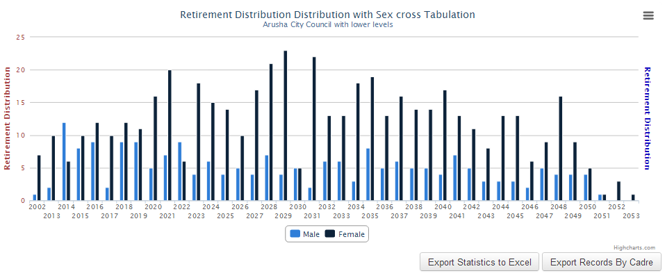

.. centered:: **fig 4.8: An aggregated report (field one: Retirement distribution, field two: sex).**

.. index:: History and Training Reports

History and Training Reports
============================

These are the reports related to the “History Management” and “In service Training management”.
The following figure shows the interface to “History and Training Report”. To generate the report you start with selecting an organization unit  followed by selecting the check box if it is to include lower level, then user will have to specify which report they want to generate, “History” report or “In service Training” report. If one selects the “In Service Training” report they will just have to select the form to use while selecting the “History” report, they will be required to select a form where data will be picked and also, what field of history is sought
Lastly there is an option of which graph type you would like the data to be presented. There are three layouts of graph in the system Bar, Pie and Line graphs the default graph type is the bar graph.
 

.. _fields_image:
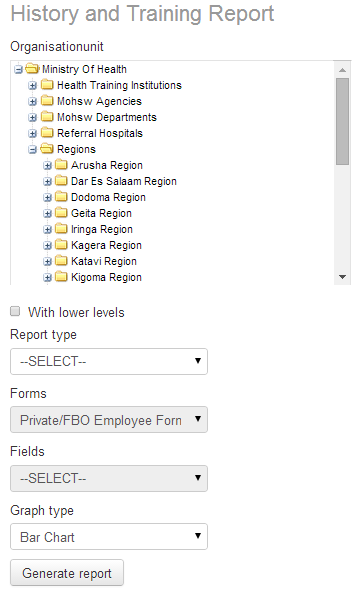

.. centered:: **fig 4.9: History and In service Training report.**

.. index:: Friendly Report

Friendly Report
===============

This report gives a set of generic reports as required by CCHP or CHOP for information on Human Resource specifically Table 11. To generate the report you first have to select which report you need from the drop down at generic report, then select organization unit followed by which form to be used.
After that one has to select target according to the group of interest. These targets have been pre-defined already in the system and are updated according to changes in the scheme of service. It is optional though to select the target or not.

.. _fields_image:
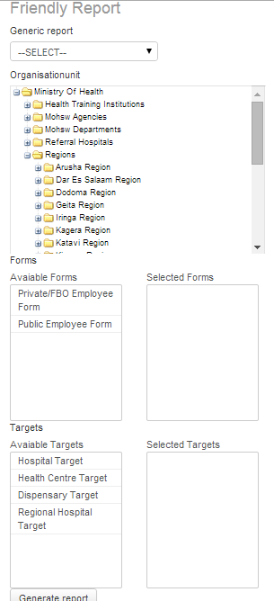

.. centered:: **fig 4.10: Friendly Reports.**

.. index:: Completeness Report

Completeness Report
===================

This report gives the percentage of data entered into the System that help users assessing data coverage. The report consists of names of facility, value of entered records and the expected number by facility, district and region. Depending on the user account one will be able to see only the levels below that of the organization unit assigned to them.

To generate the report is in two easy steps; first one has to select the organization unit then secondly select the form. See image below 

.. _fields_image:
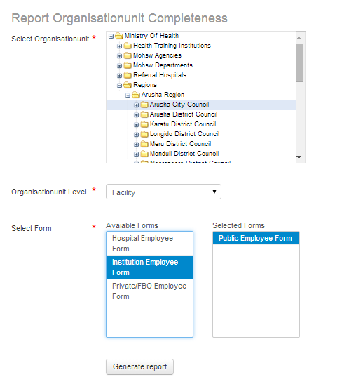

.. centered:: **fig 4.11: Image Showing steps to generate completeness Report.**

On selecting generate report one will see completeness as shown in the image below and will be able to download this report to excel by clicking the button labeled “Download to Excel” and will be able to manipulate the report further to suit their need.

.. _fields_image:
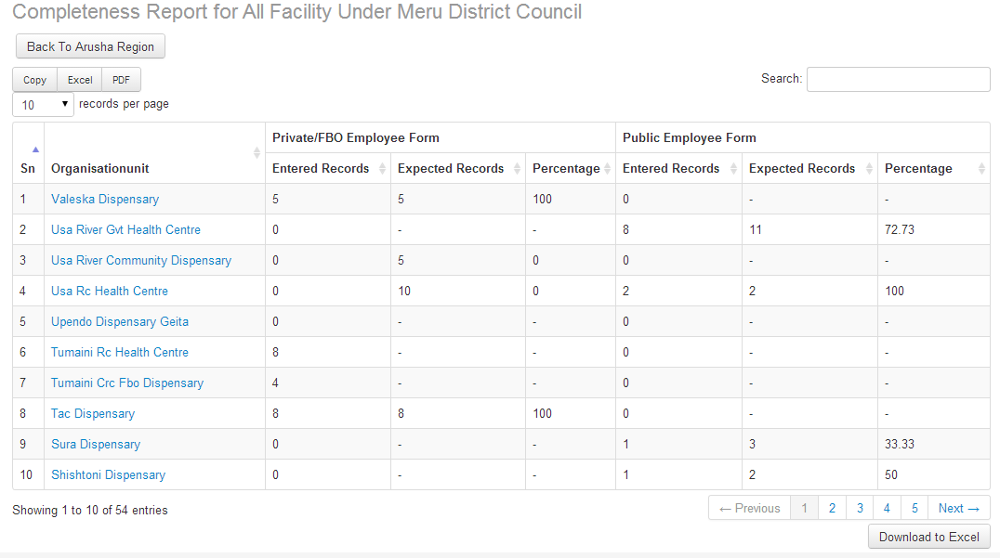

.. centered:: **fig 4.12: Image showing Completeness report  of Meru District Council.**

.. index:: Organization Unit by Level Report

Organization Unit by Level Report
=================================

This is a report of all organization units below the level which the specified user has been assigned to. 
These levels starting from the top are as shown in the diagram below:

.. _fields_image:
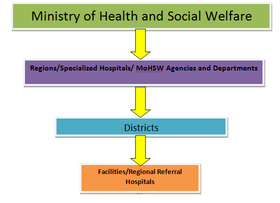

.. centered:: **fig 4.13: Image showing organization Structure by Levels in HRHIS.**

To report is easily generated in one step, by selecting the organization unit and clicking the “generate report” button

.. _fields_image:
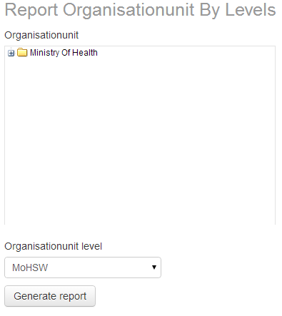

.. centered:: **fig 4.14: Image Showing steps to generate organization unit report by levels.**

.. index:: Organization Units by Groupsets Report

Organization Units by Groupsets Report
======================================

Organization Units are grouped in two ways. One is by Ownership- this helps to identify who owns the organization and second one is by Type- this identifies what category of service the organization unit is capable of offering, whether it is a Hospital, Health Center, Dispensary, or Clinic. It gives the total number in each category under selected organization unit.

As previous organization unit report by level, to generate this report is in one easy step of just selecting the organization unit and clicking the “generate report” button as seen in the following diagram.

.. _fields_image:
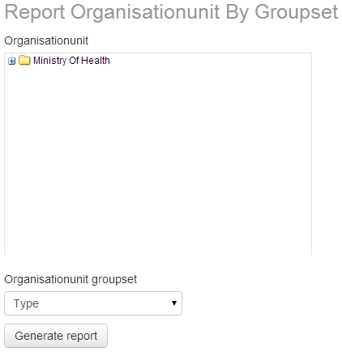

.. centered:: **fig 4.15: Image showing steps to generate organization unit report by groupset.**

 

 

 
 
