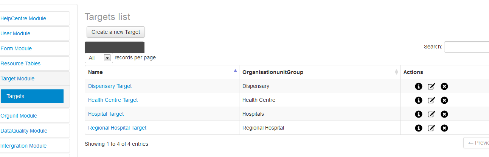

.. index:: Target Module

*************
Target Module
*************
Targets means expected numbers of employees of a certain profession corresponding to a given type of facility as detailed in the Scheme of Service of the Health Sector.

.. index:: Targets

Targets
=======

To set target click targets, there will be an option to either create a new Target, to edit the already created Targets or to delete a Target as shown below.

.. _fields_image:

.. centered:: **fig 3.1: Figure showing Targets Information.**
