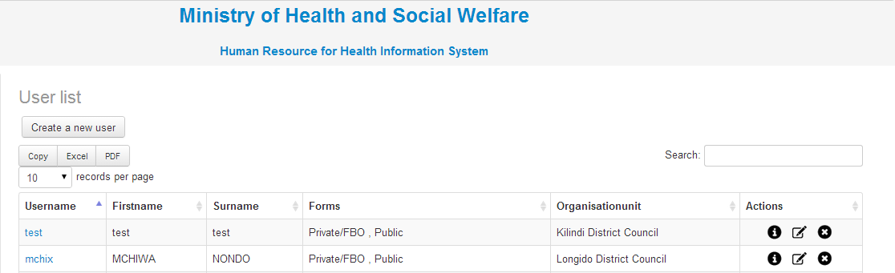
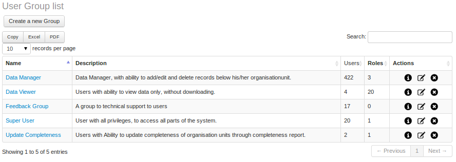


.. index:: User Module

************
User Module
************

This module consists of two sub menu namely “System Users” and “User Groups”. Each sub menu is described below.

.. index:: System Users

System Users
============

In this sub menu one can edit user credentials, delete a user or assign new registered user to their organization right organization unit.

.. _fields_image:

.. centered:: **fig 1.1: Image showing sample of users already registered in the System.**

.. index:: Users Groups

Users Groups
============

These are the groups to which the created users are assigned to according to the access level given to each. A user can be assigned to more than one group. One can create a new group, view group information, edit or delete a group.

.. _fields_image:

.. centered:: **fig 1.2: Image showing the different User Groups available in the System.**

